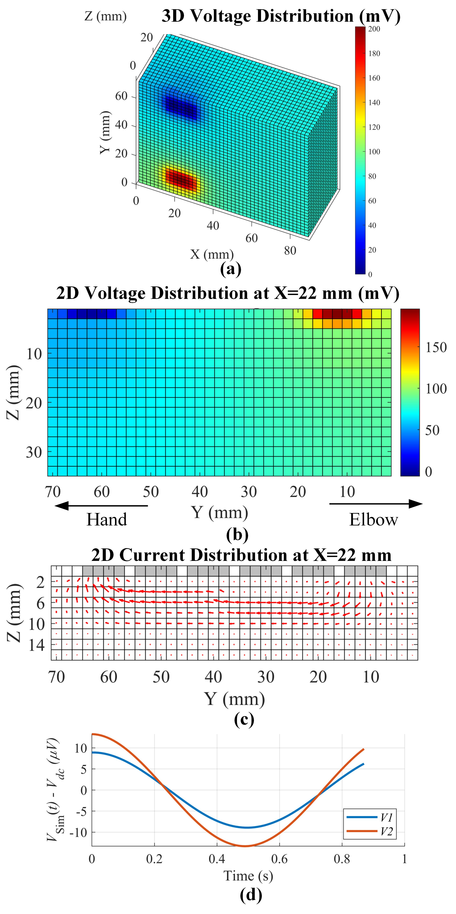

# BioZPulse-Sim-Platform(v2.0)

Overview of (a) Bio-Z sensing and (b) 3D Circuit Model.

Proposed wrist circuit model: (a) cross-section of the wrist anatomy, (b) 2D impedance map of the model at Y = 30 mm, (c) 2D impedance map at X = 23 mm , and (d) 3D impedance map.

(a) Bio-Z Sensing for PTT from the wrist, (b) Overview of the proposed wrist circuit model for Bio-Z simulation platform based on a 3D time-varying impedance grid that models arterial pulse wave and PTT. 

BioZPulse Simulation Platform for Arterial Pulse Wave Modeling by Bassem Ibrahim, Drew A. Hall and Roozbeh Jafari.
This repository includes the source code of the bio-impedance simulation platform. If you used our source code, please reference our paper:

Bassem Ibrahim, Drew A. Hall, Roozbeh Jafari, Bio-impedance Simulation Platform using 3D Time-Varying Impedance Grid for Arterial Pulse Wave Modeling, IEEE Biomedical Circuits and Systems Conference (BioCAS), October 17-19, 2019, Nara, Japan. [(Paper)][1].

BioZPulse simulation platform source code files:

MATLAB Core Functions:
- spice_netlist_3d_gen_fn.m  		Generate SPICE netlist file (netlsit.cir)
- spice_netlist_3d_run_fn.m 		Run LTSPICE Simulator
- spice_netlist_3d_pp_fn.m  		Post-processing for voltage and PTT calculations
- xyz2node_fn.m                		Convert from X,Y,Z coordinates to node index
- find_delay_fn.m			Calculate time delay of sensed pulse signal (Sinewave)	
- sinefit_fn.m                		Sinewave paramters extraction by fitting to a regression model 
- read_spice_out_fast_gnd_fn.m  	Read and sparse SPICE output file
- importfile_ltspice_raw_fast_fn.m	Import LTSPICE output file to MATLAB
- importfile_ltspice_header.m       	Import the header of the LTSPICE output file to MATLAB
- imp_image_gen_fn.m                	Adjust bio-impedance values to MATLAB

MATLAB Scripts:
- Wrist_model_example.m     Run SPICE model of the Wrist with plotting functions

Getting Started:
- Install MATLAB. This is commercial software available from The MathWorks. For system requirements and installation instructions, please refer to their documentation.
- Install LTSPICE Simulator. It is a free SPICE simulator from Analog Devices. Download link: https://www.analog.com/en/design-center/design-tools-and-calculators/ltspice-simulator.html
- Update the variable "net.param.ltspice_path" in MATLAB function "img_gen_fn.m" with your LTSPICE.exe path
- Run the required MATLAB Script

Notes:
- These MATLAB files were tested using MATLAB 2019b version

## Contact us
Bassem Ibrahim: bassem@tamu.edu

Drew A. Hall: drewhall@ucsd.edu

Roozbeh Jafari: rjafari@tamu.edu

[1]: https://www.dropbox.com/s/ymjeqd5cs1soun0/BioCAS2019_final_submission.pdf?dl=0
