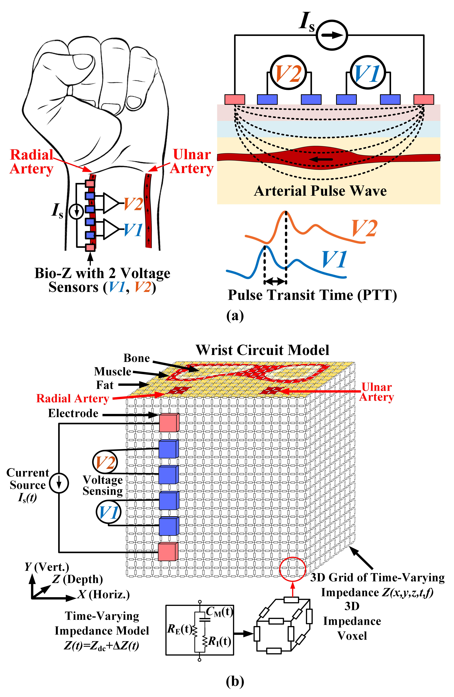

# BioZPulse-Sim-Platform

Overview of (a) Bio-Z sensing and (b) 3D time-varying Bio-Z model.

Arterial pulse amplitude across the X and Y directions at the skin surface (Z = 0): (a) and (c) current electrodes placed on the artery, (b) and (d) away from the artery by 1.25cm.

BioZPulse Simulation Platform for Arterial Pulse Wave Modeling by Bassem Ibrahim, Drew A. Hall and Roozbeh Jafari.
This repository includes the source code of the bio-impedance simulation platform. If you used our source code, please reference our paper:

Bassem Ibrahim, Drew A. Hall, Roozbeh Jafari, Bio-impedance Simulation Platform using 3D Time-Varying Impedance Grid for Arterial Pulse Wave Modeling, IEEE Biomedical Circuits and Systems Conference (BioCAS), October 17-19, 2019, Nara, Japan. [(Paper)][1].

BioZPulse simulation platform source code files:

MATLAB Functions:
- spice_netlist_3d_gen_fn.m  		Generate SPICE netlist file (netlsit.cir)
- spice_netlist_3d_run_fn.m 		Run LTSPICE Simulator
- spice_netlist_3d_pp_fn.m  		Post-processing for voltage and PTT calculations
- spice_netlist_3d_plot_fn.m 		Plot Output Results
- spice_netlist_3d_plot_fn.m 		Plot Output Results in Frequency domain
- xyz2node_fn.m                		Convert from X,Y,Z coordinates to node index
- find_delay_fn.m					Calculate time delay of sensed pulse signal (Sinewave)	
- sinefit_fn.m                		Sinewave paramters extraction by fitting to a regression model 
- read_spice_out_fast_gnd_fn.m  	Read and sparse SPICE output file
- importfile_ltspice_raw_fast_fn.m	Import LTSPICE output file to MATLAB
- importfile_ltspice_header.m       Import the header of the LTSPICE output file to MATLAB
- imp_image_gen_fn.m                Adjust bio-impoedance values to MATLAB

MATLAB Example
 - ltspice_3d_model_example.m     An example to call the MATLAB functions and set the required parameters

Getting Started:
- Install MATLAB. This is commercial software available from The MathWorks. For system requirements and installation instructions, please refer to their documentation.
- Install LTSPICE Simulator. It is a free SPICE simulator from Analog Devices. Download link: https://www.analog.com/en/design-center/design-tools-and-calculators/ltspice-simulator.html
- Update the variable "net.param.ltspice_path" in MATLAB function "spice_netlist_3d_run_fn.m" with your LTSPICE.exe path
- Run the MATLAB functions similar to the example MATLAB script.

Notes:
- These MATLAB files were tested using MATLAB 2018b version

## Contact us
Bassem Ibrahim: bassem@tamu.edu

Drew A. Hall: drewhall@ucsd.edu

Roozbeh Jafari: rjafari@tamu.edu

[1]: https://www.dropbox.com/s/ymjeqd5cs1soun0/BioCAS2019_final_submission.pdf?dl=0
